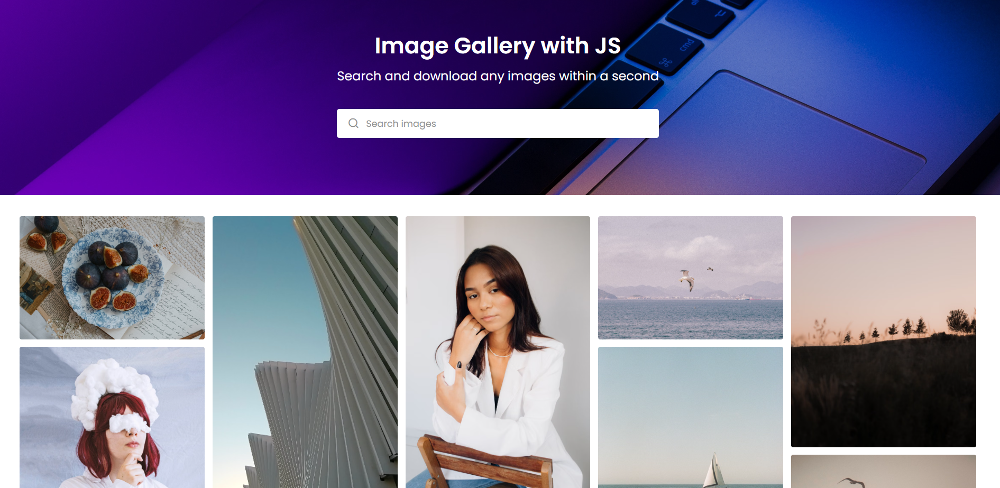

# 🖼️ Image Gallery | Vanilla JavaScript

A responsive image gallery built with **HTML, CSS, and Vanilla JavaScript**, using the **Pexels API** to fetch and display images.

This project was built to practice writing **modular and component-like JavaScript without using React**.
> **Note:** If you're using this project from Iran, you may need to use a VPN to access the Pexels API.

## ✨ Features

* 🔎 Search for images using the Pexels API
* 🖼️ Display images dynamically
* 📄 Load more images with pagination
* 🔍 Image lightbox preview
* 📥 Download images
* 📱 Responsive design
* ⚡ Asynchronous API requests with `fetch`
* 🧩 Modular JavaScript architecture
* 🚫 Built without React or other JavaScript frameworks

## 🛠️ Technologies

* HTML5
* CSS3
* JavaScript (ES6+)
* Pexels API
* ES Modules
* Fetch API
* Async / Await

## 📁 Project Structure

```text
Image-Gallery/
│
├── index.html
├── style.css
│
├── js/
│   ├── common.js
│   ├── fetch.js
│   └── script.js
│
└── README.md
```

### `common.js`

Contains shared variables, DOM elements, API configuration, and helper functions such as:

* API configuration
* Pagination state
* Search state
* DOM element references
* API URL generation
* Page reset and increment functions

### `fetch.js`

Responsible for communicating with the **Pexels API**.

It handles:

* Fetching curated images
* Searching for images
* Loading states
* Error handling
* Returning the received image data

### `script.js`

Contains the main application logic:

* Rendering images
* Search handling
* Pagination
* Event delegation
* Image downloading
* Lightbox functionality
* Lightbox closing
* Connecting different parts of the application

## 🧩 JavaScript Architecture

One of the main goals of this project was to make the JavaScript code **modular and component-like without using React**.

Instead of putting everything inside one large JavaScript file, the logic was separated into different modules based on responsibility.

For example:

```text
common.js
   ↓
Shared state & DOM elements

fetch.js
   ↓
API requests

script.js
   ↓
Application logic & UI
```

This approach helped me understand how larger applications can be organized even when working with **Vanilla JavaScript**.


## 🌐 Pexels API

This project uses the **Pexels API** to retrieve images.

You will need your own API key to run the project.

**Important:** Never commit your API key directly to GitHub. Use environment variables or another secure method for production projects.


## 🚀 How to Run

### 1. Clone the repository

### 2. Open the project

Open the project folder in VS Code.

### 3. Add your Pexels API key

Add your API key to the appropriate configuration file.

### 4. Run with a local server

Because this project uses JavaScript ES Modules, it should be opened through a local server rather than directly using `file://`.

For example, you can use **Live Server** in VS Code.

### 5. Start using the gallery

Search for images, load more results, open images in the lightbox, and download them.


## 🔮 Future Improvements

Some improvements I may add in the future:

* Better error handling
* Loading skeletons
* Favorites
* Image categories
* Dark mode
* Infinite scrolling
* Better download handling
* Improved accessibility
* Secure API key handling
* More reusable JavaScript components

## 👨‍💻 Purpose

The main purpose of this project was not only to create an image gallery, but also to practice building a small application with **Vanilla JavaScript using a modular architecture similar to the way larger frontend applications are organized**.

I specifically wanted to understand how far I could take JavaScript organization and component-like thinking **before moving to React**.


